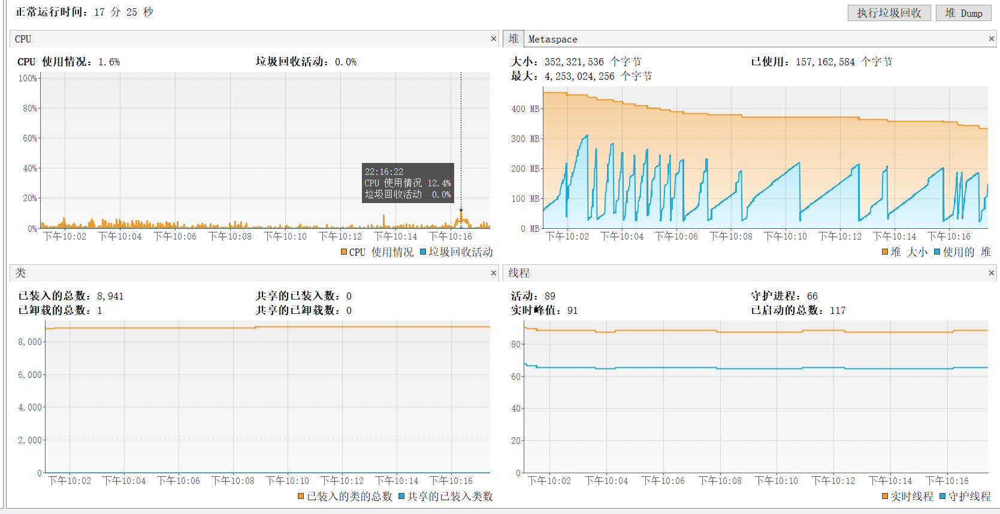
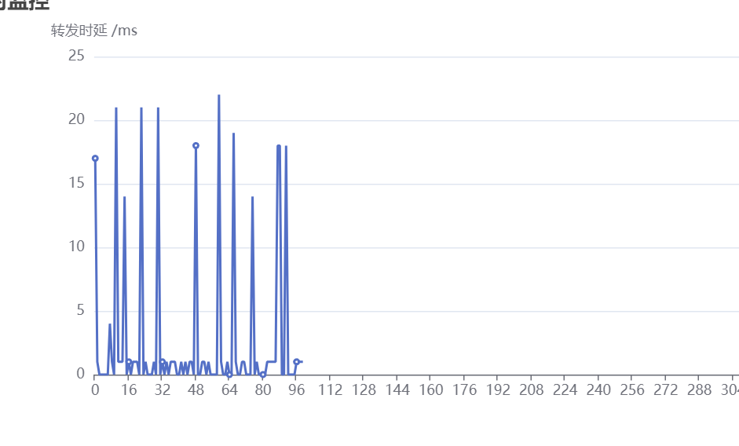
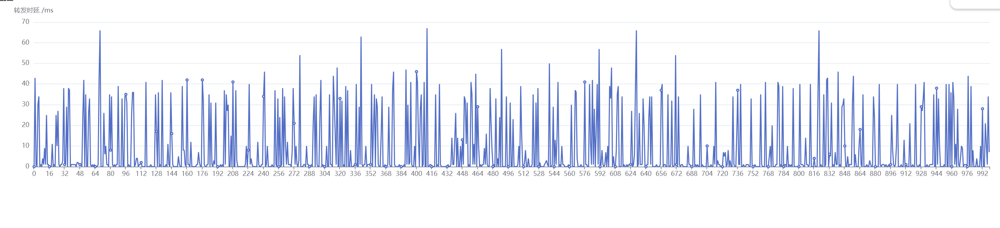
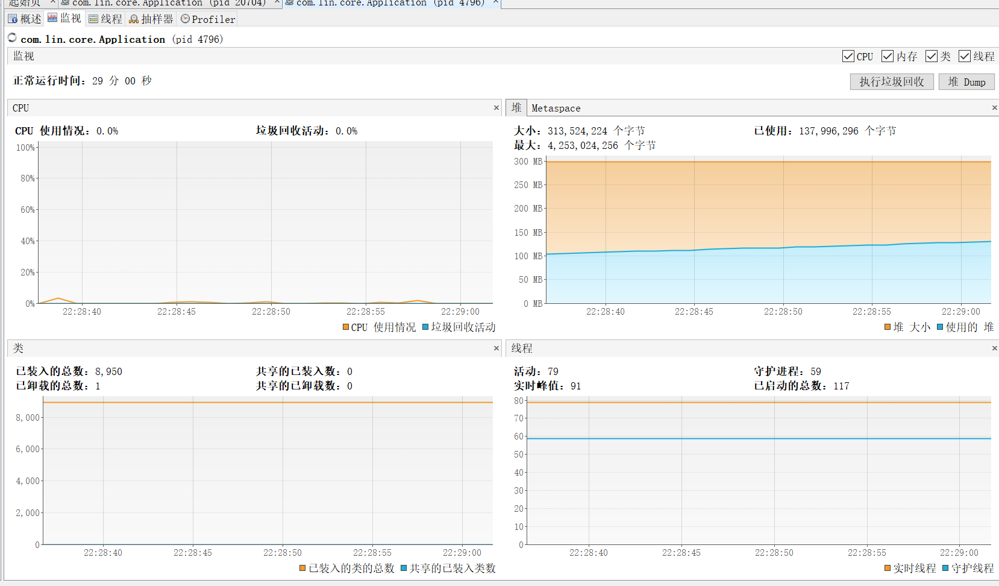
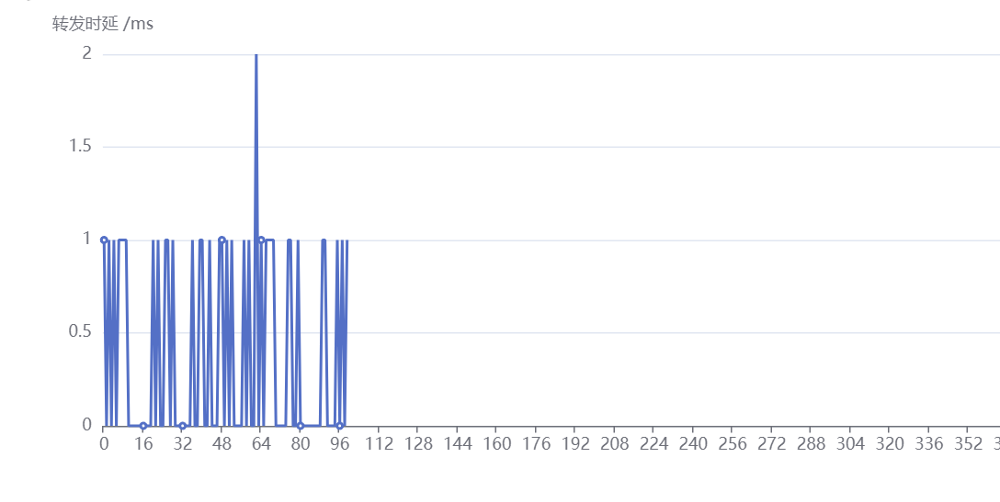
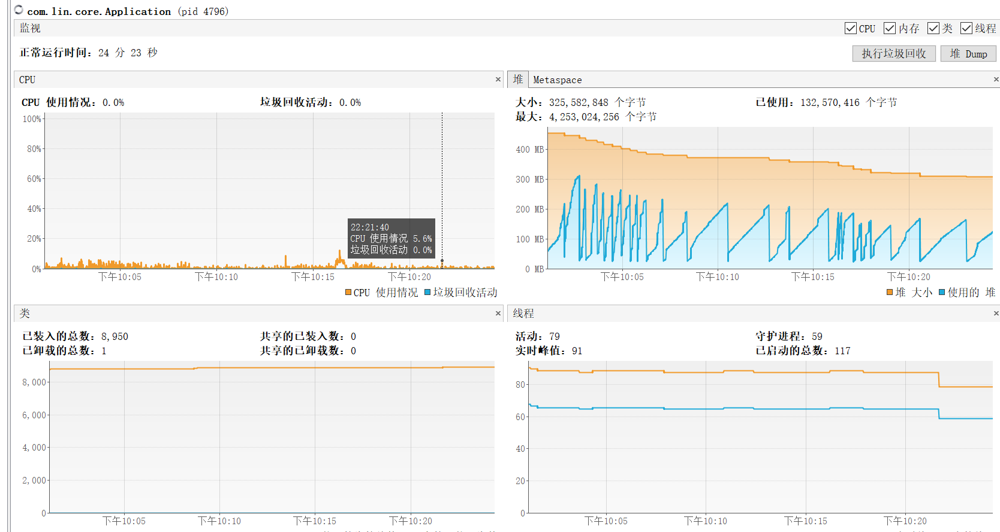
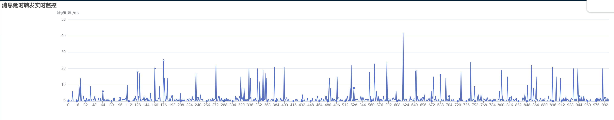

# delay queue by kafka
## 1.description
use the capabilities of kafka sdk to build a delay-queue
## 2.version
 - ~~little biz volume prioritize the branch -- feature-kafka_delay_queue-1.0.1~~
 - high scalability and high availability high biz volumn prioritize the branch --feature-kafka_delay_queue-2.0.1
### ~~2.1 version 1.0.1~~
~~provides 17 levels of delay queue capabilities,but all levels of delay queue will be created by every instance, event
thus this server boot create multiple instance. maybe cause high cpu usage.~~
### 2.2 version 2.0.1
provider 17 levels of delay queue capabilities, and all levels of delay queue will be assigned to multiple instances.
so delay queue core boot has load balancing capabilities. otherwise, delay topic unlimited horizontal scalability.
## 3.document
### 3.1 delay topic
you should create 17 levels of delay topic, and single partition
- DELAY_SECOND_1(1000L, "kafka-delay-second-1"),
- DELAY_SECOND_5(1000L*5, "kafka-delay-second-5"),
- DELAY_SECOND_10(1000L*10, "kafka-delay-second-10"),
- DELAY_SECOND_30(1000L*30, "kafka-delay-second-30"),
- DELAY_MINUTE_1(1000L * 60, "kafka-delay-minute-1"),
- DELAY_MINUTE_2(1000L * 60 * 2, "kafka-delay-minute-2"),
- DELAY_MINUTE_3(1000L * 60 * 3, "kafka-delay-minute-3"),
- DELAY_MINUTE_4(1000L * 60 * 4, "kafka-delay-minute-4"),
- DELAY_MINUTE_5(1000L * 60 * 5, "kafka-delay-minute-5"),
- DELAY_MINUTE_6(1000L * 60 * 6, "kafka-delay-minute-6"),
- DELAY_MINUTE_7(1000L * 60 * 7, "kafka-delay-minute-7"),
- DELAY_MINUTE_8(1000L * 60 * 8, "kafka-delay-minute-8"),
- DELAY_MINUTE_9(1000L * 60 * 9, "kafka-delay-minute-9"),
- DELAY_MINUTE_10(1000L * 60 * 10, "kafka-delay-minute-10"),
- DELAY_MINUTE_15(1000L * 60 * 15, "kafka-delay-minute-15"),
- DELAY_MINUTE_20(1000L * 60 * 20, "kafka-delay-minute-20"),
- DELAY_MINUTE_30(1000L * 60 * 30, "kafka-delay-minute-30"),<br>
naming conventions: ```kafka-delay-second-1---{custom}``` <br>
for example: if you want to create 1 seconds delay topic, and 3 extension topics, you should create<br>
``kafka-delay-second-1---default``<br>
``kafka-delay-second-1---one``<br>
``kafka-delay-second-1---two``<br>
and create 3 customer_group naming like<br>
``kafka-delay-second-1---default-group``<br>
  ``kafka-delay-second-1---one-group``<br>
  ``kafka-delay-second-1---two-group``<br>
## 4.experimental result
| 并发数 | 调度服务实例数 | 平均时延 | visualVm截图                                  | cpu使用率max | 消息延时转发时延                                    |
| ------ | -------------- | -------- |---------------------------------------------| ------------ |---------------------------------------------|
| 100    | 1              | 2.63ms   |   | 7.2%         |   |
| 1000   | 1              | 8.39ms   |  | 12.4%        |  |
| 100    | 2              | 0.43ms   |   | 2.3%         |   |
| 1000   | 2              | 1.475ms  |  | 3.1%         |  |
